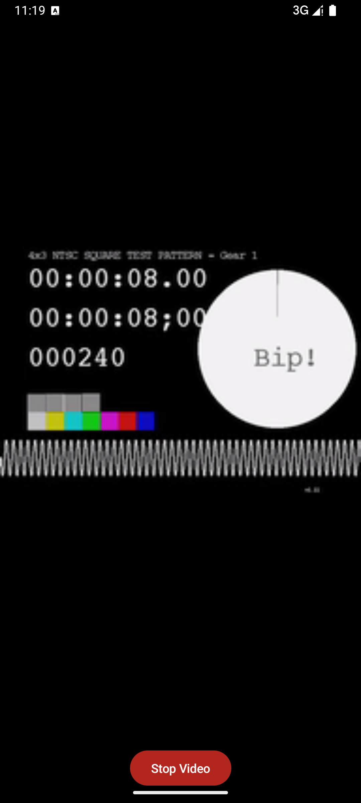
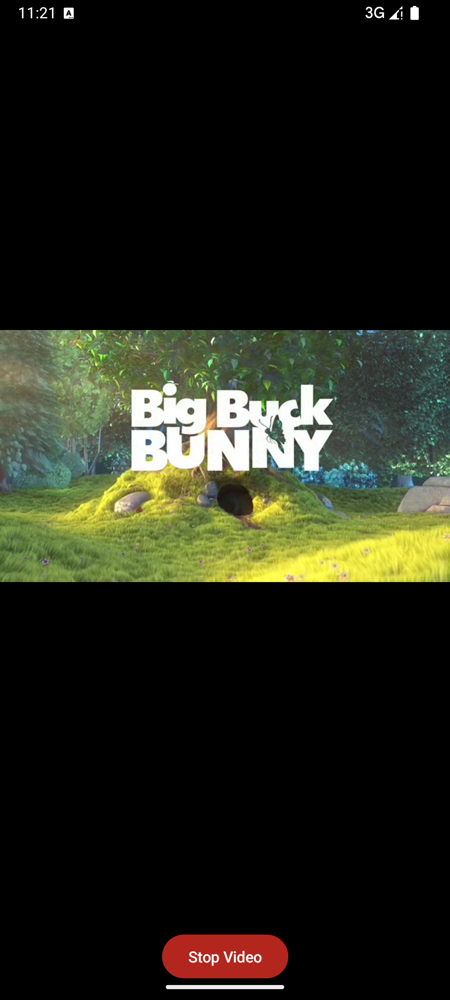

# LibVLC Android 示例

This repository contains sample Android applications demonstrating how to use LibVLC (VLC media player library) in Android applications.

本仓库包含演示如何在 Android 应用中使用 LibVLC（VLC 媒体播放器库）的示例 Android 应用程序。

## 安装


链接: <https://pan.baidu.com/s/1hjvHDnAHsCuQhaC5K1LMeQ> 提取码:3kxq 

## 屏幕截图






## 示例

### 1. Compose 示例 (`compose_sample`)

A modern Android video player built with Jetpack Compose and LibVLC.

### 1. Compose Sample (`compose_sample`)

A modern Android video player built with Jetpack Compose and LibVLC.

#### 功能特性

- **网络视频播放** - 播放来自 HTTP/HTTPS URL 或流协议（HLS、RTSP 等）的视频
- **本地资源播放** - 播放应用程序资源中捆绑的视频文件
- **设备视频选择** - 从设备存储中选择并播放视频
- **Jetpack Compose UI** - 使用 Material Design 3 的现代声明式 UI
- **LibVLC 集成** - 利用 VLC 强大的媒体播放功能

#### Features

- **Network Video Playback** - Play videos from HTTP/HTTPS URLs or streaming protocols (HLS, RTSP, etc.)
- **Local Asset Playback** - Play video files bundled in the app's assets
- **Device Video Selection** - Select and play videos from device storage
- **Jetpack Compose UI** - Modern declarative UI with Material Design 3
- **LibVLC Integration** - Leverages VLC's powerful media playback capabilities

#### 架构

- **Jetpack Compose** 用于 UI
- **VLCVideoLayout** 用于视频渲染
- **状态管理** 使用 Compose 状态和 remember
- **Activity Result API** 用于设备视频选择
- **Kotlin** 作为主要语言

#### Architecture

- **Jetpack Compose** for UI
- **VLCVideoLayout** for video rendering
- **State management** using Compose state and remember
- **Activity Result API** for device video selection
- **Kotlin** as primary language

#### 主要组件

- `MainActivity.kt` - 入口点和主要 UI 逻辑
- `VideoPlayerView.kt` - 使用 LibVLC 的可组合视频播放器视图
- `ui/theme/` - Material Design 3 主题配置

#### Key Components

- `MainActivity.kt` - Entry point and main UI logic
- `VideoPlayerView.kt` - Composable video player view using LibVLC
- `ui/theme/` - Material Design 3 theme configuration

#### 使用方法

应用程序提供三种播放视频的方式：

1. **播放网络视频**
   - 默认 URL: `http://devimages.apple.com/iphone/samples/bipbop/gear1/prog_index.m3u8`
   - 输入任何有效的视频 URL（HTTP、HTTPS、HLS、RTSP 等）
   - 点击"播放网络视频"按钮

2. **播放示例视频（资源）**
   - 播放来自 `assets/bbb.m4v` 的捆绑示例视频
   - 点击"播放示例视频（资源）"按钮

3. **从设备选择视频**
   - 打开系统视频选择器
   - 从设备存储中选择任何视频
   - 需要 READ_MEDIA_VIDEO 权限（Android 13+）或 READ_EXTERNAL_STORAGE（Android 12 及以下）

#### Usage

The app provides three ways to play videos:

1. **Play Network Video**
   - Default URL: `http://devimages.apple.com/iphone/samples/bipbop/gear1/prog_index.m3u8`
   - Enter any valid video URL (HTTP, HTTPS, HLS, RTSP, etc.)
   - Click "Play Network Video" button

2. **Play Sample Video (Asset)**
   - Plays bundled sample video from `assets/bbb.m4v`
   - Click "Play Sample Video (Asset)" button

3. **Select Video from Device**
   - Opens system video picker
   - Select any video from device storage
   - Requires READ_MEDIA_VIDEO permission (Android 13+) or READ_EXTERNAL_STORAGE (Android 12 and below)

#### 权限

```xml
<uses-permission android:name="android.permission.INTERNET" />
<uses-permission android:name="android.permission.READ_EXTERNAL_STORAGE" android:maxSdkVersion="32" />
<uses-permission android:name="android.permission.READ_MEDIA_VIDEO" />
```

#### Permissions

```xml
<uses-permission android:name="android.permission.INTERNET" />
<uses-permission android:name="android.permission.READ_EXTERNAL_STORAGE" android:maxSdkVersion="32" />
<uses-permission android:name="android.permission.READ_MEDIA_VIDEO" />
```

### 2. Java 示例 (`java_sample`)

使用 Java 和 LibVLC 的传统 Android 视频播放器。

### 3. Native 示例 (`native_sample`)

使用原生代码 (JNI) 的 LibVLC 示例。

### 2. Java Sample (`java_sample`)

Traditional Android video player using Java and LibVLC.

### 3. Native Sample (`native_sample`)

Example of using LibVLC with native code (JNI).

## 构建项目

### 先决条件

- Android Studio Arctic Fox 或更高版本
- Android SDK API 36
- Gradle 8.14.1 或更高版本
- JDK 11 或更高版本

## Building the Project

### Prerequisites

- Android Studio Arctic Fox or later
- Android SDK API 36
- Gradle 8.14.1 or later
- JDK 11 or later

### 构建步骤

1. 克隆仓库：
   ```bash
   git clone <repository-url>
   cd libvlc
   ```

2. 构建项目：
   ```bash
   ./gradlew build
   ```

3. 构建特定示例：
   ```bash
   # Compose 示例
   ./gradlew :compose_sample:assembleDebug

   # Java 示例
   ./gradlew :java_sample:assembleDebug

   # Native 示例
   ./gradlew :native_sample:assembleDebug
   ```

4. 安装到设备/模拟器：
   ```bash
   # Compose 示例
   ./gradlew :compose_sample:installDebug

   # 或使用 adb
   adb install compose_sample/build/outputs/apk/debug/compose_sample-debug.apk
   ```

### Build Steps

1. Clone the repository:
   ```bash
   git clone <repository-url>
   cd libvlc
   ```

2. Build the project:
   ```bash
   ./gradlew build
   ```

3. Build specific sample:
   ```bash
   # Compose sample
   ./gradlew :compose_sample:assembleDebug

   # Java sample
   ./gradlew :java_sample:assembleDebug

   # Native sample
   ./gradlew :native_sample:assembleDebug
   ```

4. Install on device/emulator:
   ```bash
   # Compose sample
   ./gradlew :compose_sample:installDebug

   # Or using adb
   adb install compose_sample/build/outputs/apk/debug/compose_sample-debug.apk
   ```

## LibVLC 集成

本项目使用 LibVLC 4.0（目前正在开发中）。该库作为本地模块包含（`libvlc`）。

## LibVLC Integration

This project uses LibVLC 4.0 (currently in development). The library is included as a local module (`libvlc`).

### 使用的关键 LibVLC 组件

- `LibVLC` - 主库实例
- `MediaPlayer` - 媒体播放控制器
- `Media` - 表示媒体项（文件、URL、资源）
- `VLCVideoLayout` - 用于渲染视频输出的视图

### Key LibVLC Components Used

- `LibVLC` - Main library instance
- `MediaPlayer` - Media playback controller
- `Media` - Represents a media item (file, URL, asset)
- `VLCVideoLayout` - View for rendering video output

### Example Integration

```kotlin
// Initialize LibVLC
val libVLC = remember {
    LibVLC(context, arrayListOf("-vvv"))
}

// Create MediaPlayer
val mediaPlayer = remember {
    MediaPlayer(libVLC)
}

// Create video view
AndroidView(
    factory = { ctx ->
        VLCVideoLayout(ctx).apply {
            mediaPlayer.attachViews(this, null, false, false)
        }
    }
)

// Load and play media
val media = Media(libVLC, uri)
mediaPlayer.media = media
media.release()
mediaPlayer.play()

// Cleanup
DisposableEffect(Unit) {
    onDispose {
        mediaPlayer.release()
        libVLC.release()
    }
}
```

## 支持的格式

LibVLC 支持广泛的媒体格式和协议：

### 视频编解码器
- H.264/AVC
- H.265/HEVC
- VP8/VP9
- MPEG-1/2/4
- 以及更多...

### 流协议
- HTTP/HTTPS
- HLS (HTTP Live Streaming)
- RTSP
- RTMP
- 以及更多...

### 容器格式
- MP4
- MKV
- AVI
- WebM
- 以及更多...

## Supported Formats

LibVLC supports a wide range of media formats and protocols:

### Video Codecs
- H.264/AVC
- H.265/HEVC
- VP8/VP9
- MPEG-1/2/4
- And many more...

### Streaming Protocols
- HTTP/HTTPS
- HLS (HTTP Live Streaming)
- RTSP
- RTMP
- And many more...

### Container Formats
- MP4
- MKV
- AVI
- WebM
- And many more...

## 故障排除

### 常见问题

1. **找不到 Activity 错误**
   - 确保 `build.gradle` 和源代码之间的包名匹配
   - 清理并重新构建：`./gradlew clean build`
   - 安装前从设备卸载旧版本

## Troubleshooting

### Common Issues

1. **Activity not found error**
   - Ensure package names match between `build.gradle` and source code
   - Clean and rebuild: `./gradlew clean build`
   - Uninstall old version from device before installing

2. **视频无法播放**
   - 检查 logcat 中的 VLC/libvlc 日志
   - 验证权限是否已授予
   - 确保视频 URL 可访问
   - 检查流媒体的网络连接

3. **构建错误**
   - 同步 Gradle 文件
   - 使缓存无效并重新启动 Android Studio
   - 检查 Android SDK 和构建工具版本

### 调试日志

LibVLC 使用详细日志记录（`-vvv`）进行初始化。检查 logcat：

```bash
adb logcat -s "VLC:*" "libvlc:*"
```

2. **Video not playing**
   - Check logcat for VLC/libvlc logs
   - Verify permissions are granted
   - Ensure video URL is accessible
   - Check network connectivity for streaming

3. **Build errors**
   - Sync Gradle files
   - Invalidate caches and restart Android Studio
   - Check Android SDK and build tools versions

### Debug Logging

LibVLC is initialized with verbose logging (`-vvv`). Check logcat:

```bash
adb logcat -s "VLC:*" "libvlc:*"
```

## 许可证

本项目遵循 VideoLAN 许可证条款。有关详细信息，请参见各个示例的 LICENSE 文件。

## 资源

- [LibVLC Android 文档](https://wiki.videolan.org/AndroidCompile)
- [VLC 媒体播放器](https://www.videolan.org/vlc/)
- [VideoLAN Wiki](https://wiki.videolan.org/)
- [Jetpack Compose 文档](https://developer.android.com/jetpack/compose)

## 贡献

欢迎贡献！请随时提交拉取请求或为错误和功能请求开启议题。

## 示例来源

- 示例视频："Big Buck Bunny" 由 Blender Foundation 制作（知识共享许可）
- 测试 HLS 流：Apple 的 Bipbop 示例流

## License

This project follows the VideoLAN license terms. See individual sample LICENSE files for details.

## Resources

- [LibVLC Android Documentation](https://wiki.videolan.org/AndroidCompile)
- [VLC Media Player](https://www.videolan.org/vlc/)
- [VideoLAN Wiki](https://wiki.videolan.org/)
- [Jetpack Compose Documentation](https://developer.android.com/jetpack/compose)

## Contributing

Contributions are welcome! Please feel free to submit pull requests or open issues for bugs and feature requests.

## Sample Credits

- Sample video: "Big Buck Bunny" by Blender Foundation (Creative Commons)
- Test HLS stream: Apple's Bipbop sample stream
